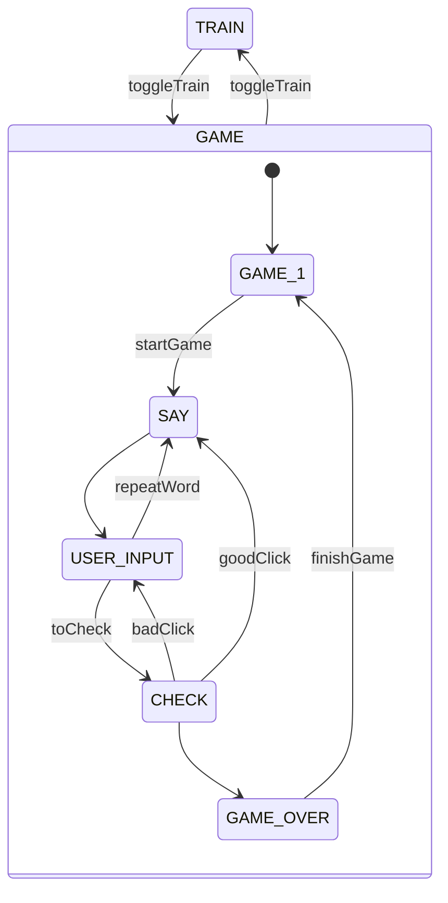

# Easy english

## Описание

Проект сайта для лбучения детей англискому языку. Приложение выводит какрточки со словами. При нажатии на карточку звучит произношение слова.

Приложение работает в двух режимах - режиме **тренировки** и режими **тестировния**.

- В режиме **тренировки** пользовтель видит слово, его перевод и может услшать произношение слова на карточке.
- В режиме **тестирования** пользователь может проверить свои знания. В этом режиме скрываются написание слов и пользователь должен угадывать слово по его произношению.

Зарегистрированным пользовтелям доступна статистика.

## Установка

1. Установка зависимостей:
   ```shell
   npm install
   ```
2. Сборка проекта
   ```shell
   npm run build
   ```
   В директории `./dist` появится собранный проект

Запуск тестового сервера:

```shell
npm install
npm run dev
```

## Реализация

Приложение реализовано в виде конечного автомата.



### Состояния

- **TRAIN** - соcтояние когда пользователю виден перевод слова и слышно его произношение.
- **GAME** - инициализация игры. Сюда попадаем при переключении из **TRAIN** или при завершении игры. Видна кнопка _PLAY_ для старта (переход `startGame`) игра.
- **SAY** - в этом состоянии произносится текущее загаданное слово и состояние меняется на **USER_INPUT**.
- **USER_INPUT** - Ожидание ввода пользователя. Пользовтель может повторить ввод, тогда выполнится переход в состояние **SAY**. Или пользователь может кликнуть по карточке - в таком случае выполниться переход `toCheck` в состояние **CHECK**.
- **CHECK** - в этом состоянии проверяется карточка на которую нажал пользоатель с текущей загадонной карточкой. В зависимости от того правильная ли это карточка и количества оставшихся карт выполняется один из следующих переходов:
  - если пользователь ошибся то переход `badClick`
  - если пользователь угадал и карточки есть - `goodClick` - произносится новая карточка
  - если пользовтель угадал и карточка последняя, то выполянется переходв состояние **GAME_OVER**
- **GAME_OVER** - в этом состояние пользовтелю показывается модально окно с результатами, выход из которого приводит к переходу `finishGame`.

При переходе в состояние срабатывает **функция инициализации состояния**. Функция инициализации состояния запускается автоматически при помощи:

```jsx
React.useEffect(() = {
   initGame();
   initSay();
   initUserInput();
   // ...
}, [state])
```

## Хранение данных

В качестве системы авторизации и хранения статичтики используется [firebase](firebase.com).
